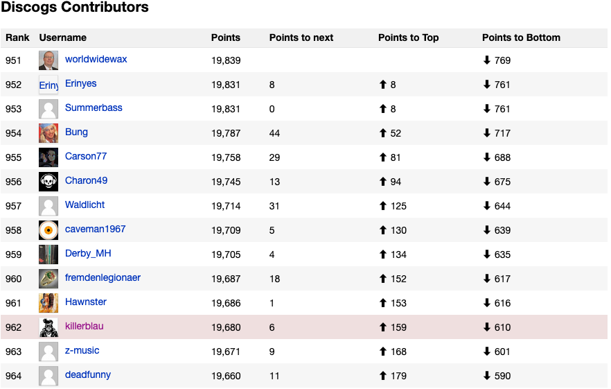
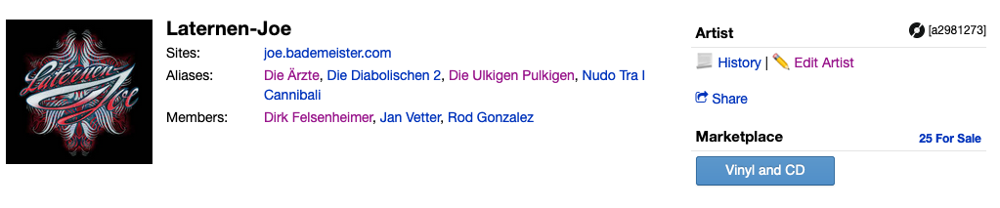
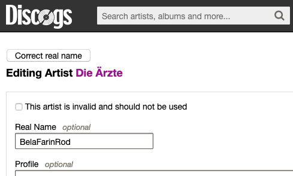

# DiscogsGreasemonkeyScripts
A collection of scripts for the Firefox Greasemonkey addon that helps to work faster and/or have a better user experience with [discogs.com](https://www.discogs.com).

## Show how many points you need to reach next place in contributor list

Script: `ContributionChart.AddDifferences.js`

This will simply add three new columns to the [contributor list](https://www.discogs.com/stats/contributors?page=20). If you give a damn about your points, you might be interested
in knowing how many points (edits) you need to advance to the next page. I lost interest
in aiming for new points but anyways.

## Add quick link to History and Edit Artist

Script: `EditArtist.DifferentiateHistoryAndEdit.js`

Are you tired of stepping from the an Artist's page via the history to
the edit page? Why not directly? This script adds this functionality:
you can choose on the artist page to jump to the History or directly to
the Edit Artist page. Please make sure you know what to edit mostly the
History contains valueable information why something in the release is
or is not listed that way.

## Faster edition of "Real name" on artist page

Script: `EditArtist.WrongRealName.js`

Ever seen a wrong artist's real name on its page? Like when the members
of a group are listed in that field? This scripts adds a "Correct real name"
button to the top of the page. Pushing that button will empty the Real Name
field, add a submission note of "Correct use of 'Real name', cf. [g18.1]."
and submit the form to the preview. The last thing you need to do is pushing
the green button "Submit Changes to Artist Page".

Please be careful what you do here. Make sure you understand the guidelines
noted in [Discogs Guidelines §18 Updating An Artist Profile](https://support.discogs.com/hc/en-us/articles/360005055513-Database-Guidelines-18-Updating-An-Artist-Profile#Real_Name).

